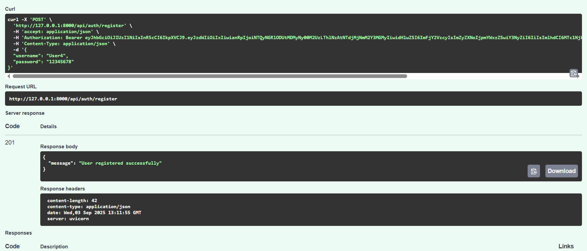
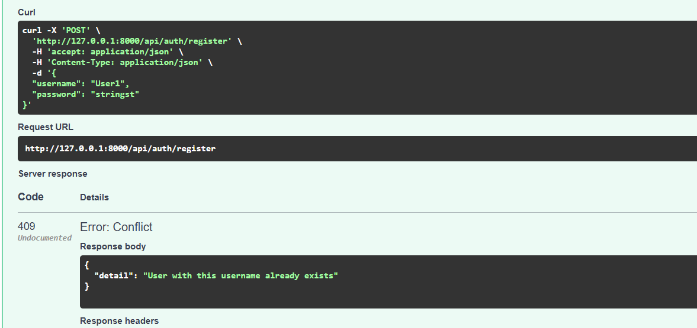
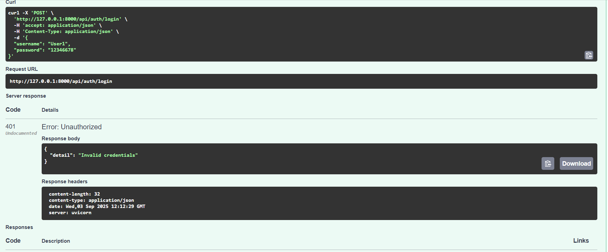
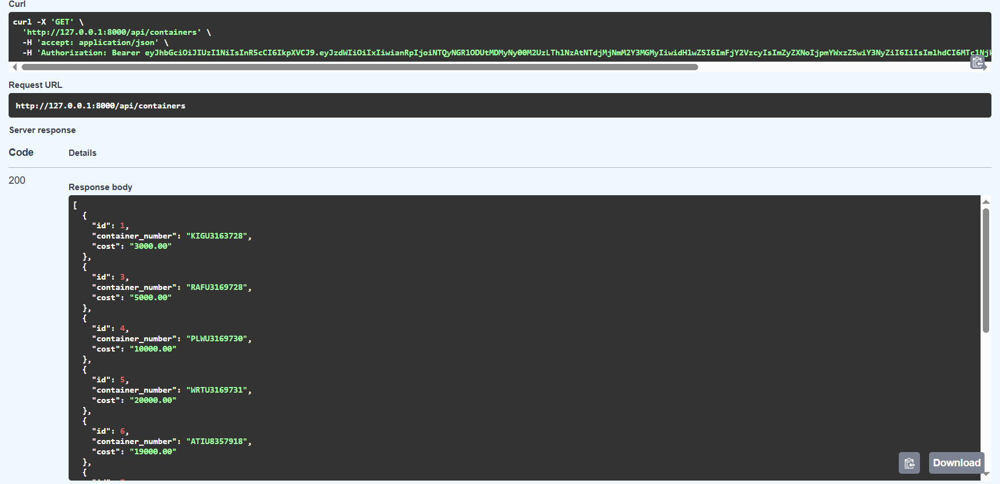
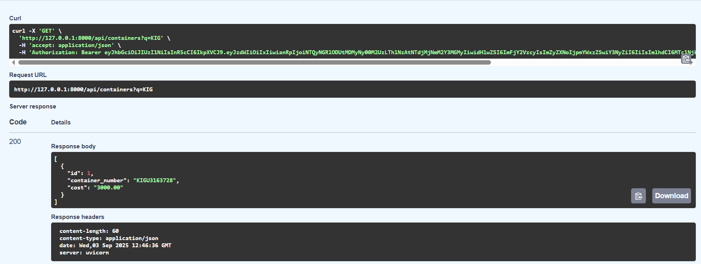
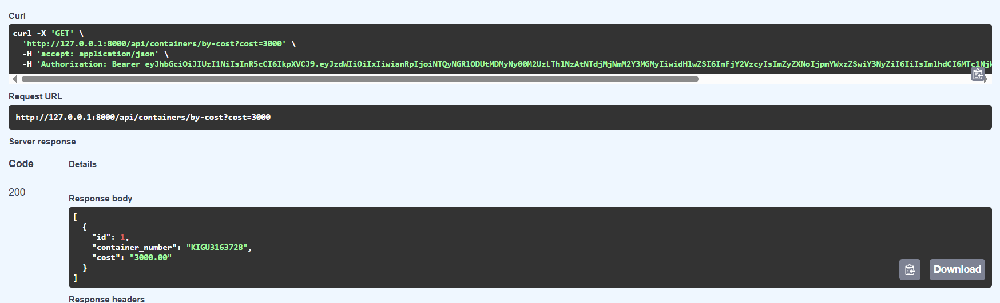
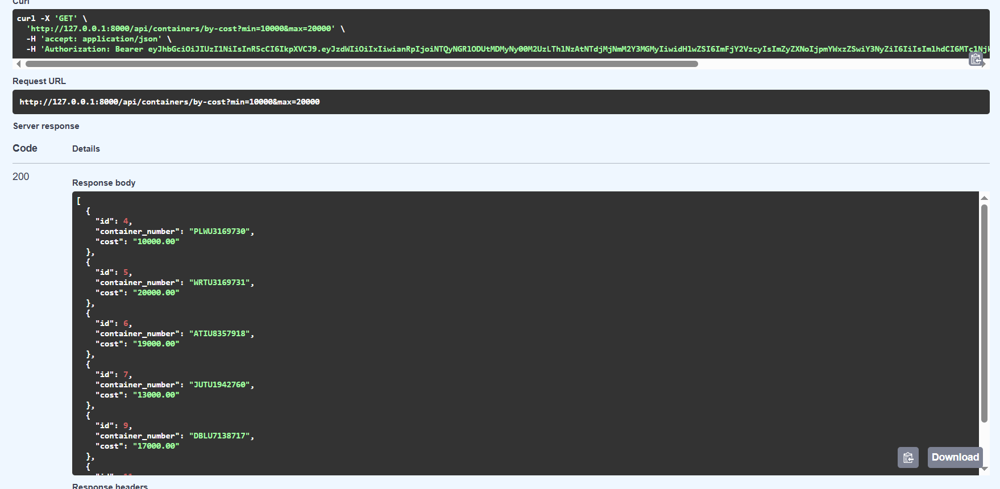
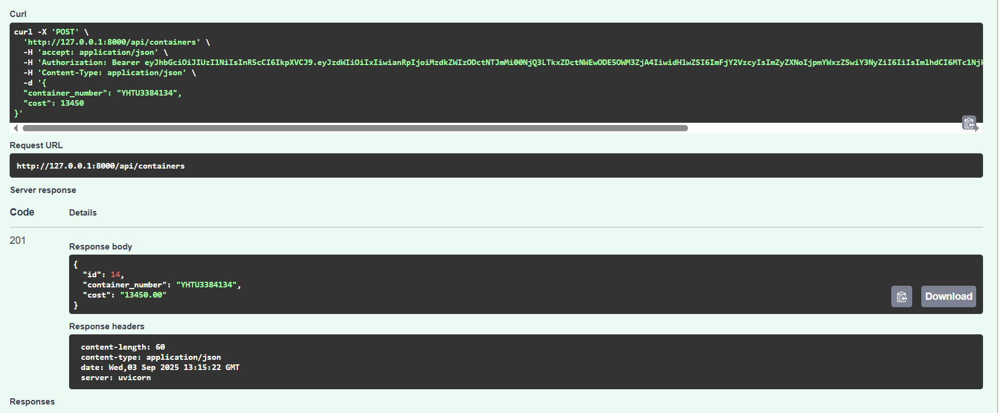
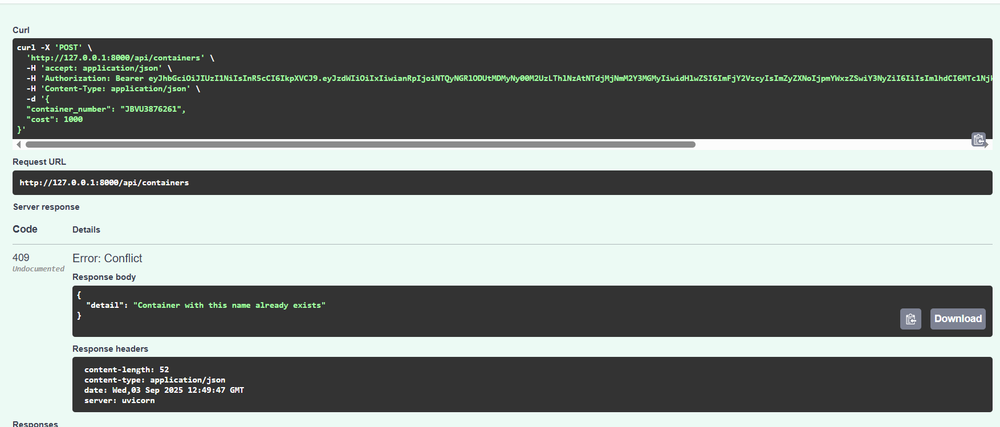
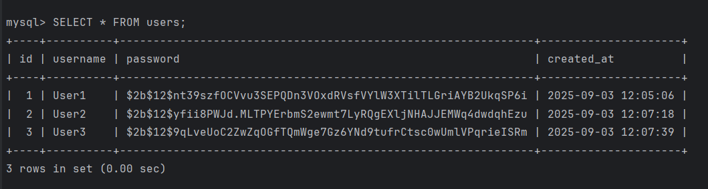

# Container Accounting API

Проект на **FastAPI** с использованием **MySQL**, **SQLAlchemy (async)**, **Alembic** и **JWT-аутентификацией**.

---

## Требования

- Docker + Docker Compose
- Python 3.12 (для локального запуска с venv)

---

## Запуск через Docker

1. Скопируйте репозиторий и создайте `.env` файл

2. Соберите и запустите контейнеры: `docker compose up --build
3. Приложение будет доступно: 
    - API: http://127.0.0.1:8000
    - Swagger UI: http://127.0.0.1:8000/docs

## Миграции (Alembic)
1. Создать новую миграцию: `docker compose exec api alembic revision --autogenerate -m "init"`
2. Применить миграции: `docker compose exec api alembic upgrade head`

## Тестирование
Создание пользователя

Создание пользователя с существующим именем

Ошибка авторизации пользователя

Получение списка контейнеров (первые 50)

Получение списка контейнеров по номеру

Получение контейнера по конкретной цене

Получение контейнеров по диапазону цен

Добавление контейнера

Добавление контейнера с существующим номером

## Хешированное хранение пароля в бд

